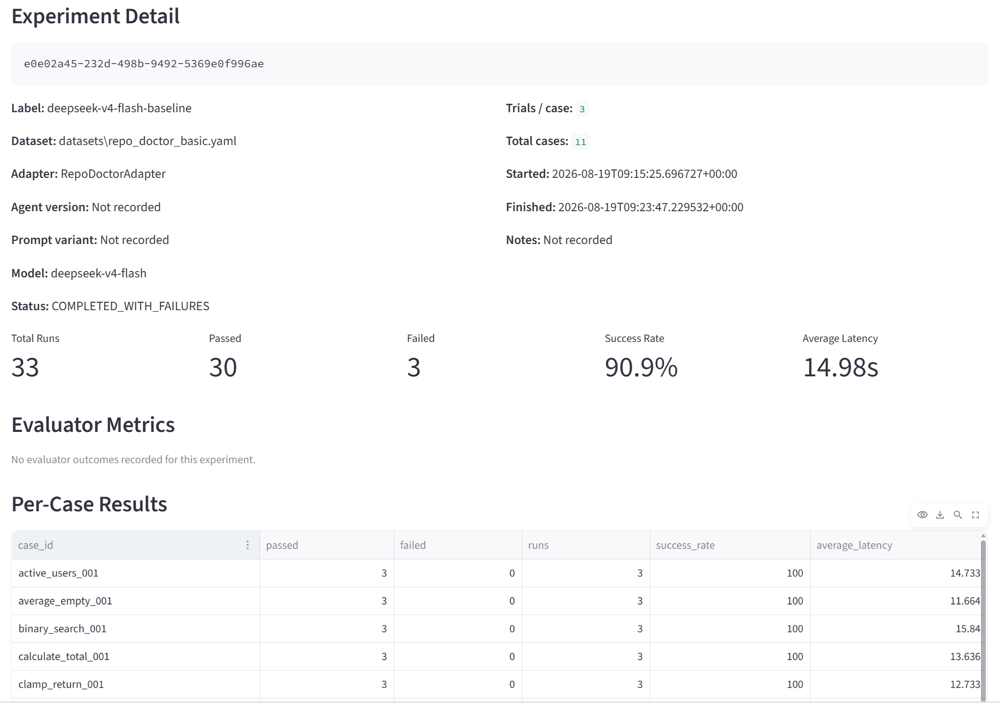
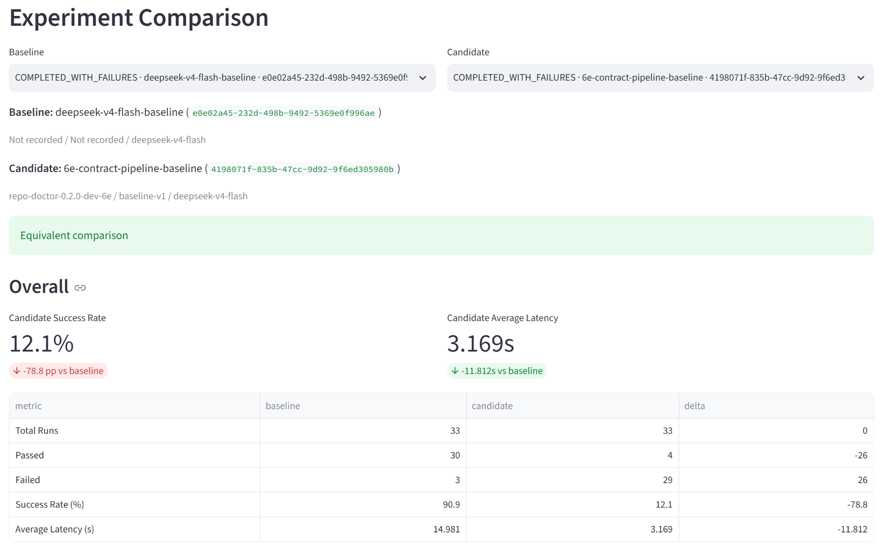
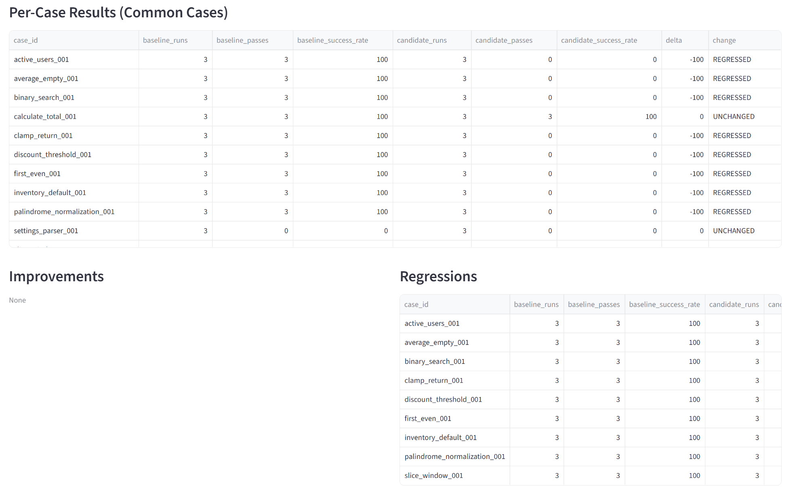
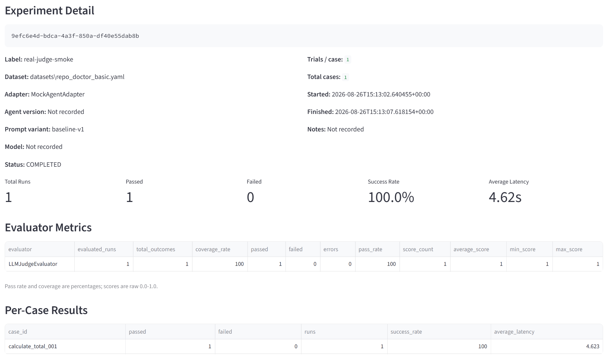

# AgentLab

Evaluation and observability platform for LLM agents.

AgentLab is infrastructure for answering the questions that matter when you build on top of LLM agents: *how capable is this agent, which configuration is better, and where does it actually fail?* Instead of judging agents by their final answer alone, AgentLab runs them against reproducible task datasets in fresh per-run staging workspaces and records the full execution — deterministic test results, declared-versus-actual file changes, structured traces, diagnostics, evaluator verdicts — into a normalized SQLite store that powers experiments, comparisons, reports, and a read-only dashboard. A staging workspace isolates evaluated files from the source checkout; it is not an OS security sandbox.

It is not a demo or a wrapper around one agent: it is an evaluation pipeline with an adapter boundary for integrating explicitly supported agent implementations, a deterministic verification gate, an optional LLM-as-Judge layer, and persistent, queryable results.

## Highlights

- **Reproducible benchmarks** — YAML task datasets, fresh per-run staging workspaces, and a deterministic `baseline manifest → pytest before → agent → file-change contract → pytest after` gate.
- **Agent adapters** — a small registry (`repo_doctor`, `mock_agent`) behind one `AgentAdapter` interface, including an optional generic suspend/resume capability.
- **Structured execution traces** — ordered, timestamped `TraceEvent`s per run with per-phase timing, diagnostics, and secret redaction.
- **Persistent experiments** — repeated trials, per-case aggregates, success rate, latency, and failure taxonomy stored in SQLite.
- **Experiment comparison** — dataset/case/trial compatibility checks plus success-rate, latency, failure-type, and evaluator deltas.
- **Evaluator framework** — `PytestEvaluator` and `LLMJudgeEvaluator` behind one `Evaluator` abstraction; evaluators run only after the deterministic gate passes.
- **LLM-as-Judge** — structured JSON verdicts (passed / score / feedback), normalized `evaluator_outcomes` persistence, and experiment-level evaluator metrics.
- **Provider-agnostic judge runtime** — a small OpenAI-compatible HTTP transport configured through environment variables; no provider SDK, no automatic retries.
- **Observability surfaces** — JSON experiment reports, a Streamlit dashboard, historical replay, and CLI inspection commands.

## Architecture

```text
Task Dataset (YAML)
        │
        ▼
Experiment / Evaluation Runner        (fresh staging workspace per run)
        │
        ▼
Agent Adapter ──► Agent Under Evaluation
        │
        ▼
Deterministic Verification            (declared file changes / pytest after)
        │
        ▼
Optional Evaluator                    (runs only when deterministic gate passes)
        │                             PytestEvaluator / LLMJudgeEvaluator
        ▼
Structured Trace + Run Result + Evaluator Outcome
        │
        ▼
SQLite  (runs · trace_events · experiments · evaluator_outcomes)
        │
        ▼
Metrics · Comparison · JSON Report · Dashboard · Replay
```

Two properties shape the design:

- The deterministic gate is authoritative: post-tests must pass and actual content changes must exactly match `expected.modified_files`. An optional evaluator (e.g. an LLM judge) can only *further* fail a run — it never rescues a failed deterministic gate.
- Evaluator outcomes are first-class persisted data, not trace JSON parsed on demand. Aggregations and comparisons read the normalized `evaluator_outcomes` table.

## Evaluation Examples

The screenshots below are historical persisted examples, not benchmark promises or current capability claims. Re-run the bundled dataset in your own environment to produce comparable evidence.

### Repeated-Trial Benchmark

AgentLab evaluates agents across reproducible benchmark cases and repeated trials rather than relying on a single run. In this experiment, Repo Doctor completed 30 of 33 runs across 11 repair cases with three trials per case.



*11 benchmark cases × 3 trials, with persisted per-case success rates and latency metrics.*

### Experiment Comparison

Persisted experiments can be compared without re-running the agent. AgentLab checks experiment compatibility and surfaces changes in success rate, latency, and other aggregate metrics.



*The candidate pipeline reduced average latency from 14.981 s to 3.169 s, but its success rate regressed from 90.9% to 12.1%.*

### Per-Case Regression Analysis

Aggregate metrics alone can hide where a configuration changed behavior. AgentLab compares common benchmark cases individually and classifies them as improved, regressed, or unchanged.



*Case-level comparison exposes regressions that would be difficult to diagnose from the overall success-rate delta alone.*

### LLM-as-Judge

AgentLab also supports an optional post-verification evaluator. The result below is a persisted historical smoke test produced through the real OpenAI-compatible judge runtime against DeepSeek's compatible API.



*The persisted **`LLMJudgeEvaluator`** outcome shows 100% evaluator coverage, a passing verdict, zero evaluator errors, and a score of 1.0. Viewing the stored result does not re-execute the provider request.*

## Core Concepts

- **Agent Adapter** — the boundary between AgentLab and an agent under evaluation. Adapters implement `repair(workspace, task)` and may contribute identity metadata, preflight validation, and diagnostics.
- **Eval Case / Dataset** — a task (`repository` + `task` description + expected properties) and a YAML collection of cases. Datasets are validated before evaluation.
- **Run** — one completed repair execution: pytest must fail before the agent, the post-test workspace becomes the authoritative pre-agent baseline, the agent must satisfy the declared file-change contract, pytest must pass afterward without changing the agent's files, and then any optional evaluator runs. A suspended execution is stored separately and is not a PASS or FAIL run.
- **Experiment** — repeated independent trials over selected cases with persisted metadata (agent version, prompt variant, notes) and aggregate metrics.
- **Trace** — the ordered, sanitized event log of a run (`run_start`, pytest phases, `agent_end`, `evaluator_end`, errors, `run_end`) with timestamps and per-phase elapsed time.
- **Evaluator** — any object implementing `evaluate(workspace, case) -> EvaluationOutcome` (`passed`, `score`, `feedback`, `metadata`).
- **Evaluator Outcome** — one persisted evaluator execution (`PASS` / `FAIL` / `ERROR`, score on a raw 0.0–1.0 scale, feedback, sanitized metadata, error type, elapsed time).

## Quick Start

No API key is required for the local quick-start path. `mock_agent` is an intentionally deterministic harness for the `calculate_total_001` fixture; it proves the orchestration and persistence path, not model capability.

```bash
uv sync
uv run agentlab agents list
```

Run a single-trial experiment on one case of the bundled dataset:

```bash
uv run agentlab experiment datasets/repo_doctor_basic.yaml \
  --agent mock_agent \
  --trials 1 \
  --case calculate_total_001 \
  --label my-first-baseline
```

The experiment output includes the experiment id. Inspect the persisted results without re-executing the agent:

```bash
uv run agentlab experiments            # recent experiments
uv run agentlab experiment-show <experiment_id>
uv run agentlab runs                   # recent runs
uv run agentlab trace <run_id>         # the stored structured trace
uv run agentlab report <experiment_id> --output reports/<experiment_id>.json
```

Compare two persisted experiments (e.g. after changing `--prompt-variant` or `--agent-version`):

```bash
uv run agentlab compare <baseline_experiment_id> <candidate_experiment_id>
```

For the quick-start case, the trace should show this evidence chain (run IDs and timings vary):

```text
run_start
pytest_before_end          FAIL
workspace_baseline
agent_end                  OK
workspace_verification_end PASS
pytest_after_end           PASS
final_workspace_verification_end PASS
run_end                    PASS
```

The bundled `repo_doctor` agent runs only from a verified Repo Doctor checkout and its checkout-local virtual environment; it never falls back to a `repo-doctor` executable or package on `PATH`. Current Repo Doctor releases are preview-only by default. AgentLab therefore refuses to start or resume Repo Doctor unless the operator explicitly passes `--repo-doctor-trusted-execution`; with that consent AgentLab invokes Repo Doctor with its required `--trusted-execution` flag. Trusted execution can run repository-defined commands as the current user inside the isolated workspace and is not an OS sandbox.

Only regular, single-link files can contribute authoritative workspace evidence. AgentLab rejects symbolic links, Windows junctions/reparse points, and detectable hard links in a staged workspace rather than following them or allowing them to certify a file-change contract, final verification, or evaluator input. Hard-link rejection relies on the host filesystem reporting reliable link-count and file-identity metadata; it cannot provide that guarantee on filesystems that do not.

## Resumable Repo Doctor Evaluations

Set `AGENTLAB_REPO_DOCTOR_PROJECT` to the absolute, canonical Repo Doctor checkout path. The checkout must contain its own virtual environment (`.venv/Scripts/python.exe` on Windows or `.venv/bin/python` on POSIX). Windows development environments may omit the variable only when `D:\repo-doctor` exists; POSIX always requires explicit configuration.

When `REPO_DOCTOR_TOOLHUB_PROJECT` is configured, AgentLab starts Repo Doctor with its MCP backend. A single-case evaluation can then pause if Repo Doctor's versioned repair-session report says approval is pending:

```text
uv run agentlab eval datasets/repo_doctor_basic.yaml --agent repo_doctor \
  --repo-doctor-trusted-execution
WAITING_FOR_APPROVAL
Execution ID: <agentlab-execution-id>
Resume with: agentlab resume <agentlab-execution-id> --repo-doctor-trusted-execution
```

The command exits with status 75 while waiting. The operator approves through Repo Doctor's documented ToolHub trusted-admin workflow, then resumes the preserved evaluation:

```bash
uv run agentlab resume <agentlab-execution-id> --repo-doctor-trusted-execution
```

AgentLab never approves its own operation, never treats a ToolHub request ID as authority, and never reproduces Repo Doctor's approval-state logic. Repo Doctor owns request-status reconciliation, resume-tool validation, replay protection, and ToolHub trace correlation. AgentLab stores the control-plane context needed to resume and inspect the evaluation: its execution ID, Repo Doctor's opaque repair-session ID, the marked temporary workspace path, the case snapshot, pytest-before state, source baseline digest, pre-agent and post-agent manifests, persistence context, and sanitized trace. Active execution sessions are bounded, versioned JSON under the platform state directory (override with absolute `AGENTLAB_STATE_ROOT`); final `EvalResult` rows remain strictly PASS or FAIL in SQLite. Older suspended sessions that lack the authoritative post-`pytest-before` manifest fail closed and must be restarted.

Each resume attempt holds a per-execution operating-system file lock. This prevents two AgentLab processes from resuming the same execution concurrently, while allowing a later process to recover a session left in `RESUMING` after the prior process exited. Before recovery, AgentLab verifies that the original repository still matches the baseline digest captured at suspension. Repo Doctor's own persisted lifecycle remains authoritative: if its opaque session already reached a terminal phase, the adapter reconciles that state without replaying the provider/tool request.

Inspect execution control state and its persisted trace without replaying anything:

```bash
uv run agentlab executions
uv run agentlab execution-show <execution_id>
```

The workspace remains present while approval is pending and is cleaned only after terminal completion or failure. Agent Runtime V1 supports the ordinary single-evaluation CLI path. Repeated-trial experiments continue to work when no suspension occurs, but abort explicitly if an agent suspends; the suspended trial is not counted as FAIL and experiment metrics are not redesigned in V1.

## LLM-as-Judge

AgentLab includes an optional judge layer for tasks where deterministic tests are not the whole story. The judge runtime uses the OpenAI-compatible chat-completions protocol over plain HTTP, without a vendor SDK. The integration is provider-agnostic by design and has been smoke-tested end to end against DeepSeek's compatible API.

Configuration comes from dedicated environment variables — the agent-under-test provider settings are never reused:

```bash
export AGENTLAB_JUDGE_API_KEY="<your-key>"
export AGENTLAB_JUDGE_BASE_URL="https://api.deepseek.com"   # example provider
export AGENTLAB_JUDGE_MODEL="deepseek-v4-flash"             # example model
export AGENTLAB_JUDGE_TIMEOUT_SECONDS="60"                  # optional, default 60
```

Enable the judge on any of the three entry points with `--evaluator llm_judge`:

```bash
uv run agentlab eval datasets/repo_doctor_basic.yaml --agent mock_agent --evaluator llm_judge
uv run agentlab experiment datasets/repo_doctor_basic.yaml --agent mock_agent \
  --trials 1 --case calculate_total_001 --evaluator llm_judge --label judge-trial
uv run agentlab benchmark datasets/repo_doctor_basic.yaml --agent mock_agent \
  --trials 3 --evaluator llm_judge
```

Semantics worth knowing:

- The evaluator runs **only after** the red-to-green pytest transition, the declared file-change contract, and final workspace-identity check pass. A failed deterministic gate skips the judge entirely.
- The judge must return a structured JSON verdict (`passed`, `score` 0.0–1.0, `feedback`, optional `model`). Invalid responses become `ERROR` outcomes with a diagnostic error type.
- Provider failures (timeouts, network errors, HTTP statuses, malformed bodies) are surfaced as safe, typed errors — never with keys, headers, prompts, or raw response bodies — and are persisted as evaluator `ERROR` outcomes. There is no automatic retry.
- Every outcome lands in the normalized `evaluator_outcomes` table and feeds experiment-level evaluator metrics (coverage, pass rate, score statistics) and evaluator-aware comparisons.

## Experiments & Comparison

- **Repeated trials** — each selected case runs `N` independent trials; every completed trial is persisted immediately.
- **Metrics** — totals, success rate, average latency, per-case aggregates, and a failure taxonomy that prefers structured agent diagnostics and otherwise identifies workspace-contract, test-gate, evaluator, or runtime failures.
- **Evaluator metrics** — per-evaluator coverage, verdict pass rate (errors excluded from the denominator), and score statistics on the raw 0.0–1.0 scale.
- **Comparison** — a pure, deterministic comparison of two persisted experiments with compatibility evidence (dataset, case sets, trials, evaluator sets) and deltas for success rate, latency, failure types, and shared evaluator metrics.

## Observability

- Every run emits an ordered, sanitized trace: baseline identity, phases, statuses, elapsed time, actual/missing/unexpected file changes, and structured diagnostics for failures.
- A PASS is persisted only when its trace contains the complete, correctly ordered deterministic-gate evidence, including a failing pytest-before run, successful agent completion, passing pytest-after run, required workspace-contract checks, and any configured evaluator outcome. FAIL traces remain available for diagnosis.
- Sensitive fields are defensively sanitized and redacted across tracing, persistence, replay, dashboard presentation, and reporting.
- All data lives in a single SQLite database (default `agentlab.db` under the platform state directory, override with `AGENTLAB_DB_PATH`), written atomically per run and safe to open read-only. The database and `AGENTLAB_STATE_ROOT` must remain outside every evaluated source repository; AgentLab rejects overlapping control paths before evaluation.
- The dashboard's historical replay view re-renders persisted traces without re-executing anything.

## Dashboard

A read-only Streamlit dashboard is included:

```bash
uv run streamlit run dashboard/app.py
```

It renders the overview, runs, run detail (trace viewer and evaluator outcomes), historical replay, experiments (including evaluator metrics), and the comparison view with compatibility warnings. Set `AGENTLAB_DB_PATH` to point it at a specific database.

## Development

```bash
uv sync                 # install dependencies
uv run pytest -q        # run the test suite (uses no paid API or network)
uv run ruff check .     # lint
```

The test suite covers the runner, workspace-change contract, adapters, resumable crash recovery and locking, tracing, persistence invariants, experiments, comparison, evaluators (including a fully mocked HTTP judge transport), reporting, and dashboard view models. No test requires network access or real provider credentials. AgentLab supports Python 3.10 and newer; the runtime avoids newer-only standard-library APIs.

## Project Status

AgentLab is a functional evaluation platform under active development. It runs single-machine, sequential experiments today: no distributed orchestration, no token/cost tracking, no experiment-level suspension, and no automatic agent onboarding — an agent participates through an adapter you write. Test and Repo Doctor subprocesses are bounded, but the limits are fixed runtime defaults rather than per-command CLI controls. The deterministic evaluation core, resumable single-case runtime, experiment persistence, comparison, and evaluator pipeline (including the real OpenAI-compatible judge runtime) are implemented and tested.
